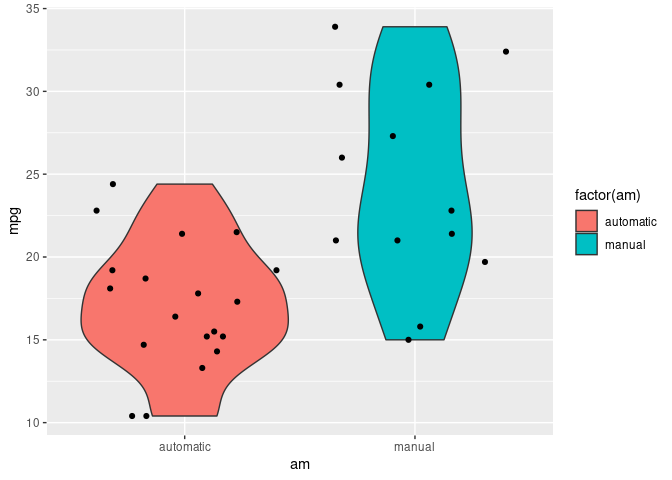
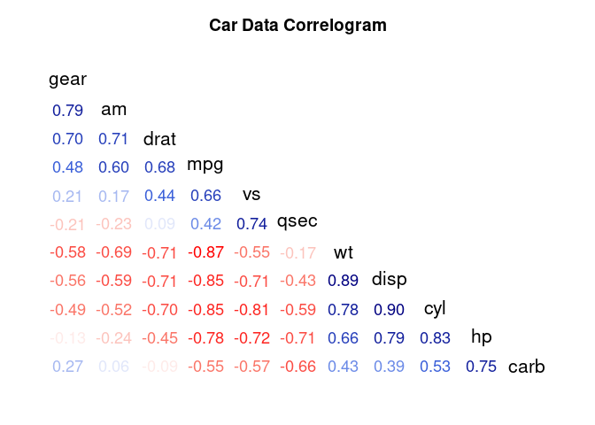
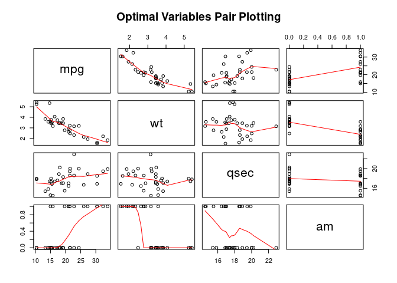
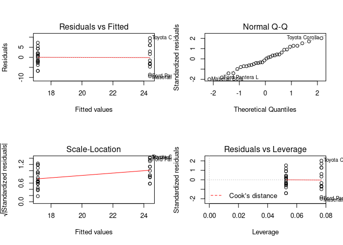

## 0. Executive Summary

The Motor Trend US magazine is a very famous magazine in the United States for producing accurate data about automobile. The Motor Trend Car Road Tests (mtcars) is a dataset that was extracted from the 1974 and comprises fuel consumption based on 10 aspects of 32 models of automobile design and performance, collected by the Motor Trend US magazine.

This project analysis mtcars with a particular interest in the following questions:

- Is an automatic or manual transmission better for MPG?
- Quantify the MPG difference between automatic and manual transmissions.

It is conclude that there is a significant difference between the MPG of manual and automatic transmission vehicles. The manual automobiles have a better fuel efficiency (2.94 MPG more) than automatic ones.

## 1. Exploratory Data Analysis


```r
# Load libraries
library(ggplot2)
library(dplyr)
library(corrgram)
library(caret)

# Data analyses
data <- mtcars
dim(data)
```

```
## [1] 32 11
```

```r
head(data)
```

```
##                    mpg cyl disp  hp drat    wt  qsec vs am gear carb
## Mazda RX4         21.0   6  160 110 3.90 2.620 16.46  0  1    4    4
## Mazda RX4 Wag     21.0   6  160 110 3.90 2.875 17.02  0  1    4    4
## Datsun 710        22.8   4  108  93 3.85 2.320 18.61  1  1    4    1
## Hornet 4 Drive    21.4   6  258 110 3.08 3.215 19.44  1  0    3    1
## Hornet Sportabout 18.7   8  360 175 3.15 3.440 17.02  0  0    3    2
## Valiant           18.1   6  225 105 2.76 3.460 20.22  1  0    3    1
```

```r
summary(data)
```

```
##       mpg             cyl             disp             hp       
##  Min.   :10.40   Min.   :4.000   Min.   : 71.1   Min.   : 52.0  
##  1st Qu.:15.43   1st Qu.:4.000   1st Qu.:120.8   1st Qu.: 96.5  
##  Median :19.20   Median :6.000   Median :196.3   Median :123.0  
##  Mean   :20.09   Mean   :6.188   Mean   :230.7   Mean   :146.7  
##  3rd Qu.:22.80   3rd Qu.:8.000   3rd Qu.:326.0   3rd Qu.:180.0  
##  Max.   :33.90   Max.   :8.000   Max.   :472.0   Max.   :335.0  
##       drat             wt             qsec             vs        
##  Min.   :2.760   Min.   :1.513   Min.   :14.50   Min.   :0.0000  
##  1st Qu.:3.080   1st Qu.:2.581   1st Qu.:16.89   1st Qu.:0.0000  
##  Median :3.695   Median :3.325   Median :17.71   Median :0.0000  
##  Mean   :3.597   Mean   :3.217   Mean   :17.85   Mean   :0.4375  
##  3rd Qu.:3.920   3rd Qu.:3.610   3rd Qu.:18.90   3rd Qu.:1.0000  
##  Max.   :4.930   Max.   :5.424   Max.   :22.90   Max.   :1.0000  
##        am              gear            carb      
##  Min.   :0.0000   Min.   :3.000   Min.   :1.000  
##  1st Qu.:0.0000   1st Qu.:3.000   1st Qu.:2.000  
##  Median :0.0000   Median :4.000   Median :2.000  
##  Mean   :0.4062   Mean   :3.688   Mean   :2.812  
##  3rd Qu.:1.0000   3rd Qu.:4.000   3rd Qu.:4.000  
##  Max.   :1.0000   Max.   :5.000   Max.   :8.000
```

```r
# Data correlation
corr <- cor(data)
corr_high <- findCorrelation(corr, cutoff=0.75)
names(data)[corr_high]
```

```
## [1] "cyl"  "disp" "mpg"  "gear"
```

```r
# t-test
t_test <- t.test(mpg~am, data=data)
t_test$p.value
```

```
## [1] 0.001373638
```

```r
t_test$estimate
```

```
## mean in group 0 mean in group 1 
##        17.14737        24.39231
```

```r
# summary of mpg, by transmission type
data %>%
        mutate(tr_type = ifelse(am == 0, no="manual", yes="automatic")) %>%
        group_by(tr_type) %>%
        summarise(median=median(mpg), mean=mean(mpg), sd=sd(mpg), min=min(mpg), max=max(mpg), count=n()) 
```

```
## # A tibble: 2 x 7
##   tr_type   median  mean    sd   min   max count
##   <chr>      <dbl> <dbl> <dbl> <dbl> <dbl> <int>
## 1 automatic   17.3  17.1  3.83  10.4  24.4    19
## 2 manual      22.8  24.4  6.17  15    33.9    13
```

Data analyses conclusions:

1. We can see higher correlations between "cyl", "disp", "mpg", and "gear".

2. The p-value is less than 0.05. The null hypothesis "there is no correlation between transmission type and mpg" is rejected.

3. There is more "automatic" data (6 more), but their median, mean, standard deviation, min, and max are all less than corresponding "manual" values.

**Note:** refer to the **Appendix** section for the plotting.

## 2. Build Model

### 2.1. Linear Regression


```r
linear_model <- lm(mpg~am, data=data)
summary(linear_model)$adj.r.squared
```

```
## [1] 0.3384589
```

The value of ~0.34 represents ~34% (a low value) of the variation in the linear model. Hence, we going to examine other models. 

### 2.2. Multi-variate Model


```r
model <- lm(mpg~., data=data)
step_model <- step(model, k=log(nrow(data)), trace=FALSE)
summary(step_model)$adj.r.squared
```

```
## [1] 0.8335561
```

```r
summary(step_model)
```

```
## 
## Call:
## lm(formula = mpg ~ wt + qsec + am, data = data)
## 
## Residuals:
##     Min      1Q  Median      3Q     Max 
## -3.4811 -1.5555 -0.7257  1.4110  4.6610 
## 
## Coefficients:
##             Estimate Std. Error t value Pr(>|t|)    
## (Intercept)   9.6178     6.9596   1.382 0.177915    
## wt           -3.9165     0.7112  -5.507 6.95e-06 ***
## qsec          1.2259     0.2887   4.247 0.000216 ***
## am            2.9358     1.4109   2.081 0.046716 *  
## ---
## Signif. codes:  0 '***' 0.001 '**' 0.01 '*' 0.05 '.' 0.1 ' ' 1
## 
## Residual standard error: 2.459 on 28 degrees of freedom
## Multiple R-squared:  0.8497,	Adjusted R-squared:  0.8336 
## F-statistic: 52.75 on 3 and 28 DF,  p-value: 1.21e-11
```

Based on the step function, the optimal set of features is: {mpg ~ wt + qsec + am}. The variation is ~83% (an high value) in this case. Refer to the **Appendix** section for the plotting.

### 2.3. Fit and Select Model


```r
best_model <- lm(mpg ~ wt + qsec + am, data=data)
summary(best_model)$adj.r.squared # confirming adj.r.squared
```

```
## [1] 0.8335561
```

```r
# Select final model
anova(linear_model, step_model, best_model)
```

```
## Analysis of Variance Table
## 
## Model 1: mpg ~ am
## Model 2: mpg ~ wt + qsec + am
## Model 3: mpg ~ wt + qsec + am
##   Res.Df    RSS Df Sum of Sq      F   Pr(>F)    
## 1     30 720.90                                 
## 2     28 169.29  2    551.61 45.618 1.55e-09 ***
## 3     28 169.29  0      0.00                    
## ---
## Signif. codes:  0 '***' 0.001 '**' 0.01 '*' 0.05 '.' 0.1 ' ' 1
```

```r
confint(best_model)
```

```
##                   2.5 %    97.5 %
## (Intercept) -4.63829946 23.873860
## wt          -5.37333423 -2.459673
## qsec         0.63457320  1.817199
## am           0.04573031  5.825944
```

```r
summary(best_model)$coef
```

```
##              Estimate Std. Error   t value     Pr(>|t|)
## (Intercept)  9.617781  6.9595930  1.381946 1.779152e-01
## wt          -3.916504  0.7112016 -5.506882 6.952711e-06
## qsec         1.225886  0.2886696  4.246676 2.161737e-04
## am           2.935837  1.4109045  2.080819 4.671551e-02
```

Refer to **Appendix** section for the residual plotting.

## 3. Conclusions

Based on the models, plotting, and adopted strategy, we can conclude:

1. The multivariate model suggests an am of 2.94 MPG for Manual (better) transmission over Automatic.

2. The weight of a car holds to the fuel efficiency of lighter vehicles.

3. Residual plotting provides heteroscedasticity information of the built models.

4. The Residuals vs Fitted plots shows the difference about the independence of the variables.

5. The Normal Q-Q plots displays a normal distribution of the points.

6. The Scale-Location plots shows the variance of the points randomly distributed.

7. The Residuals vs Leverage plots displays that values fall within 0.5 mark.

## 4. Appendix

### 4.1. Violin Plot (Data Analysis)


```r
data_plot <- data
data_plot %>%
        mutate(am = ifelse(am == 0, no='manual', yes='automatic')) %>%
        ggplot(aes(x=am, y=mpg)) +
        geom_violin(aes(fill=factor(am))) +
        geom_jitter(height=0)
```

<!-- -->

### 4.2. Motor Trend Card Road Tests Data Correlogram


```r
corrgram(data, order=TRUE, upper.panel=NULL, main="Car Data Correlogram", lower.panel=panel.cor)
```

<!-- -->

### 4.3. Optimal Variables Plotting


```r
data_optimal <- select(data, mpg, wt, qsec, am)
pairs(x=data_optimal, panel=panel.smooth, main="Optimal Variables Pair Plotting")
```

<!-- -->

### 4.4. Residual Plotting

#### 4.4.1. First Model


```r
par(mfrow=c(2,2))
plot(linear_model)
```

<!-- -->

#### 4.4.2. Better Model


```r
par(mfrow=c(2,2))
plot(best_model)
```

<!-- -->


